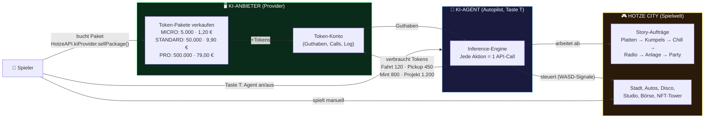
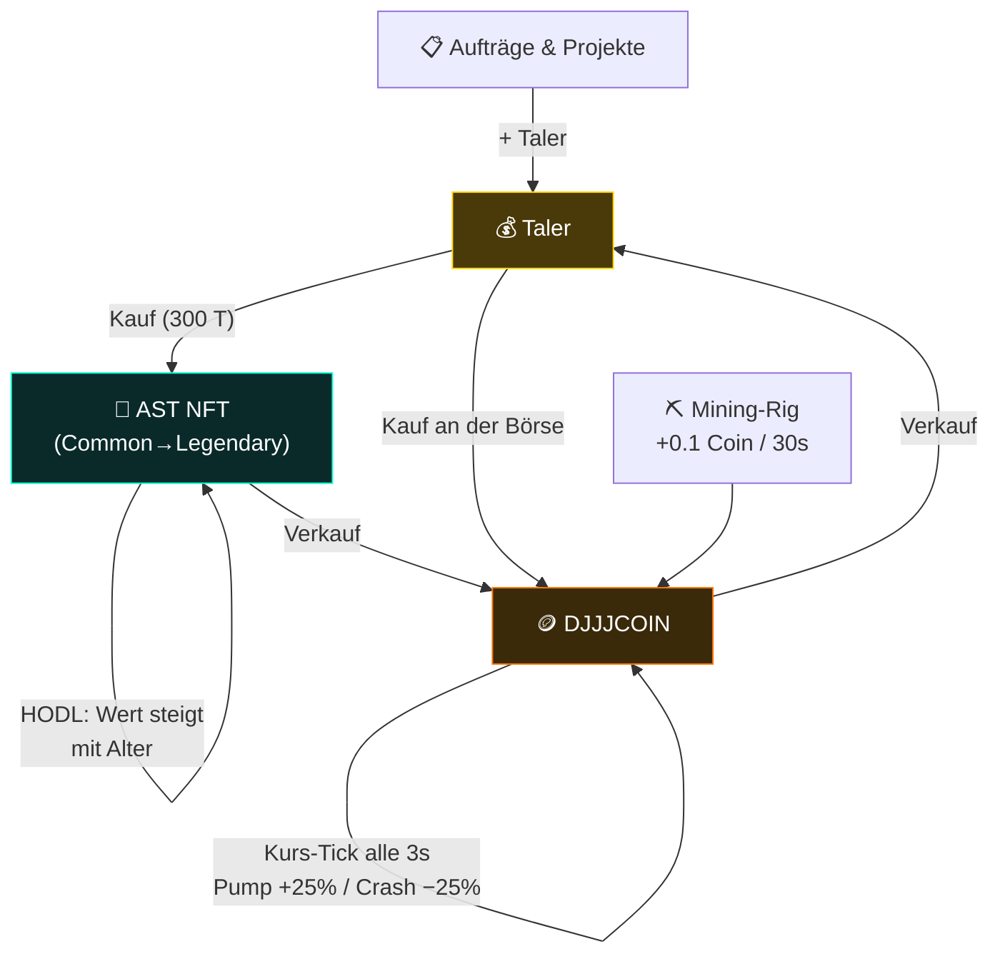
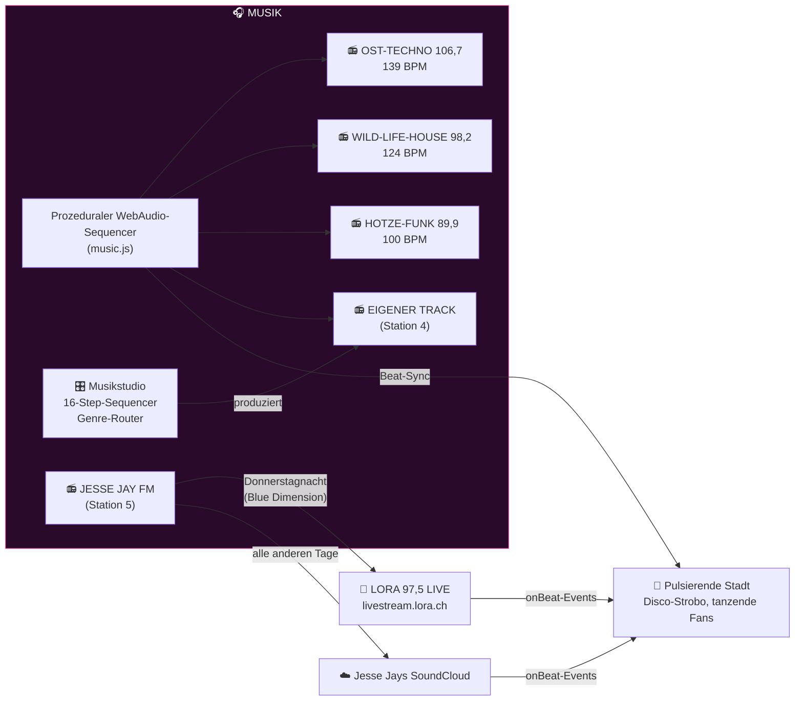
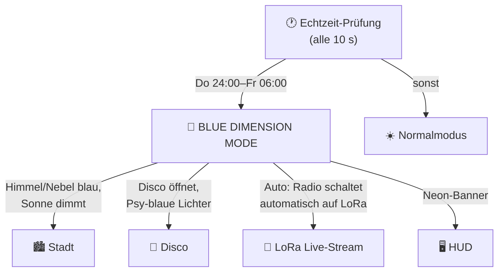

# Hotze City — Systemarchitektur

## 1. KI-Anbieter-Modell (Token-Abrechnung)

```mermaid
flowchart LR
    subgraph ANBIETER["🖥️ KI-ANBIETER (Provider)"]
        PKG["Token-Pakete verkaufen<br/>MICRO: 5.000 · 1,20 €<br/>STANDARD: 50.000 · 9,90 €<br/>PRO: 500.000 · 79,00 €"]
        KONTO["Token-Konto<br/>(Guthaben, Calls, Log)"]
    end

    subgraph AGENT["🤖 KI-AGENT (Autopilot, Taste T)"]
        INF["Inference-Engine<br/>Jede Aktion = 1 API-Call"]
    end

    subgraph SPIEL["🎮 HOTZE CITY (Spielwelt)"]
        QUEST["Story-Aufträge<br/>Platten → Kumpels → Chill →<br/>Radio → Anlage → Party"]
        WELT["Stadt, Autos, Disco,<br/>Studio, Börse, NFT-Tower"]
    end

    Spieler["👤 Spieler"] -->|"bucht Paket<br/>HotzeAPI.kiProvider.sellPackage()"| PKG
    PKG -->|"+Tokens"| KONTO
    KONTO -->|"Guthaben"| INF
    INF -->|"verbraucht Tokens<br/>Fahrt 120 · Pickup 450<br/>Mint 800 · Projekt 1.200"| KONTO
    INF -->|"steuert (WASD-Signale)"| WELT
    INF -->|"arbeitet ab"| QUEST
    Spieler -->|"spielt manuell"| WELT
    Spieler -->|"Taste T: Agent an/aus"| AGENT

    style ANBIETER fill:#0a2a1a,stroke:#33ff77,color:#fff
    style AGENT fill:#1a1a3e,stroke:#7fd4ff,color:#fff
    style SPIEL fill:#2a1a0a,stroke:#ffd700,color:#fff
```

## 2. Wirtschaftskreislauf

```mermaid
flowchart TD
    AUFG["📋 Aufträge & Projekte"] -->|"+ Taler"| TALER["💰 Taler"]
    TALER -->|"Kauf (300 T)"| NFT["🧩 AST NFT<br/>(Common→Legendary)"]
    NFT -->|"HODL: Wert steigt<br/>mit Alter"| NFT
    NFT -->|"Verkauf"| DJJJ["🪙 DJJJCOIN"]
    TALER -->|"Kauf an der Börse"| DJJJ
    DJJJ -->|"Kurs-Tick alle 3s<br/>Pump +25% / Crash −25%"| DJJJ
    DJJJ -->|"Verkauf"| TALER
    MINE["⛏️ Mining-Rig<br/>+0.1 Coin / 30s"] --> DJJJ

    style TALER fill:#4a3a0a,stroke:#ffd700,color:#fff
    style DJJJ fill:#3a2a0a,stroke:#ff7700,color:#fff
    style NFT fill:#0a2a2a,stroke:#00ffcc,color:#fff
```

## 3. Musik- & Radio-System

```mermaid
flowchart LR
    subgraph MUSIK["🎧 MUSIK"]
        SEQ["Prozeduraler WebAudio-Sequencer<br/>(music.js)"]
        S1["📻 OST-TECHNO 106,7<br/>139 BPM"]
        S2["📻 WILD-LIFE-HOUSE 98,2<br/>124 BPM"]
        S3["📻 HOTZE-FUNK 89,9<br/>100 BPM"]
        STUDIO["🎛️ Musikstudio<br/>16-Step-Sequencer<br/>Genre-Router"]
        S4["📻 EIGENER TRACK<br/>(Station 4)"]
        S5["📻 JESSE JAY FM<br/>(Station 5)"]
    end

    STUDIO -->|"produziert"| S4
    SEQ --> S1 & S2 & S3 & S4
    S5 -->|"Donnerstagnacht<br/>(Blue Dimension)"| LORA["📡 LORA 97,5 LIVE<br/>livestream.lora.ch"]
    S5 -->|"alle anderen Tage"| SC["☁️ Jesse Jays SoundCloud"]
    LORA & SC -->|"onBeat-Events"| PULS["🌆 Pulsierende Stadt<br/>Disco-Strobo, tanzende Fans"]
    SEQ -->|"Beat-Sync"| PULS

    style MUSIK fill:#2a0a2a,stroke:#ff69b4,color:#fff
```

## 4. Blue Dimension Weekly Special

```mermaid
flowchart TD
    CLOCK["🕐 Echtzeit-Prüfung<br/>(alle 10 s)"] -->|"Do 24:00–Fr 06:00"| BLUE["🌊 BLUE DIMENSION MODE"]
    CLOCK -->|"sonst"| NORMAL["☀️ Normalmodus"]
    BLUE -->|"Himmel/Nebel blau,<br/>Sonne dimmt"| STADT["🏙️ Stadt"]
    BLUE -->|"Disco öffnet,<br/>Psy-blaue Lichter"| DISCO["🪩 Disco"]
    BLUE -->|"Auto: Radio schaltet<br/>automatisch auf LoRa"| RADIO["📡 LoRa Live-Stream"]
    BLUE -->|"Neon-Banner"| HUD["🖥️ HUD"]
```
