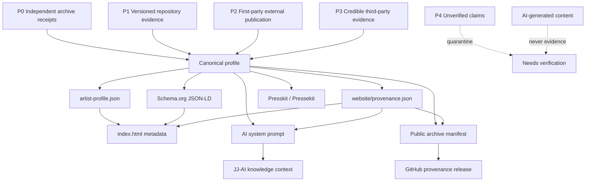

# DJ Jesse Jay Provenance Architecture

## Trust rule

`P0 > P1 > P2 > P3 > P4 > generated content`

The graph is directional: generated website/AI copy may consume canonical evidence but may not promote itself back into the evidence layer.
